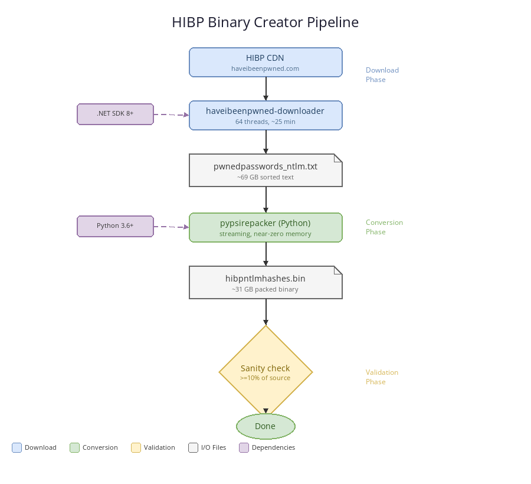

# HIBP Binary Creator

Automated PowerShell toolchain that downloads the full **Have I Been Pwned NTLM password hash list** and compresses it into a compact binary file for offline use with tools like [Get-BadPasswords](https://github.com/improsec/Get-BadPasswords).

**Output:** `hibpntlmhashes<ddMMyy>.bin` (~31 GB)



---

## Quick Start

```powershell
# 1. Check prerequisites (reports missing with install instructions)
.\PrepareEnv.ps1 -All

# 2. Or check AND auto-install missing prerequisites
.\PrepareEnv.ps1 -All -EnableAutoInstall

# 3. Run the pipeline
.\BinaryCreator.ps1
```

---

## Prerequisites

| Requirement | Auto-installed | Notes |
| --- | :-: | --- |
| PowerShell 5.1+ | -- | Built-in on Windows 10/11 |
| Python 3.6+ | Yes | Hash conversion (pypsirepacker) |
| [.NET SDK 8+](https://dotnet.microsoft.com/download/dotnet/8.0) | Yes | Required by haveibeenpwned-downloader |
| Internet access | -- | ~69 GB download from the HIBP CDN |
| 100 GB free disk | -- | ~69 GB text + ~31 GB binary during conversion |

By default, `PrepareEnv.ps1` only **checks** prerequisites and reports what is missing
with manual install instructions. Pass `-EnableAutoInstall` to allow automatic installation.

---

## Documentation

| Page | Description |
| --- | --- |
| [Architecture](docs/Architecture.md) | Pipeline overview, binary format spec, components |
| [Operations](docs/Operations.md) | All parameters, settings file, scheduling, disk management |
| [Troubleshooting](docs/Troubleshooting.md) | Common errors and solutions |

---

## Downstream Use

| Use Case | Tool |
| --- | --- |
| AD password audit | [Get-BadPasswords](https://github.com/improsec/Get-BadPasswords) by Improsec |
| ADTiering password hygiene | [ADTiering](https://github.com/FrederikLeed/ADTiering) `Test-ADTPasswordHygiene` |

---

## Credits

| Project | Authors | License |
| --- | --- | --- |
| [PwnedPasswordsDownloader](https://github.com/HaveIBeenPwned/PwnedPasswordsDownloader) | Troy Hunt and contributors | BSD-3-Clause |
| pypsirepacker | Improsec A/S, Valdemar Caroe | BSD-3-Clause |
| [Have I Been Pwned](https://haveibeenpwned.com) | Troy Hunt | -- |

---

## License

Scripts in this repository are provided under the [MIT License](LICENSE).
The bundled `pypsirepacker/` package carries the [BSD-3-Clause License](pypsirepacker/LICENSE).
